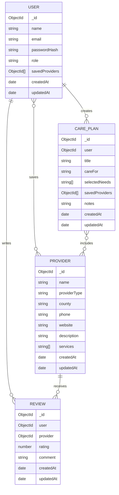

# CareCompass Database Model

## Overview

CareCompass will use MongoDB to store application data. The database will support user accounts, long-term care provider information, provider reviews, saved providers, and personalized care plans.

The main database collections will be:

1. Users
2. Providers
3. Reviews
4. Care Plans

MongoDB ObjectIds will be used to create relationships between the collections.

---

# 1. User Model

The User collection will store account information for people using CareCompass.

```js
{
  _id: ObjectId,
  name: String,
  email: String,
  passwordHash: String,
  role: String,
  savedProviders: [ObjectId],
  createdAt: Date,
  updatedAt: Date
}
```

## Field Descriptions

* `_id`: Automatically generated MongoDB identifier
* `name`: User’s full name
* `email`: User’s email address
* `passwordHash`: Hashed version of the user’s password
* `role`: User role, such as `"user"` or `"admin"`
* `savedProviders`: Array containing references to saved Provider documents
* `createdAt`: Date the account was created
* `updatedAt`: Date the account was last updated

## Validation

* Name will be required.
* Email will be required and unique.
* Email will be stored in lowercase.
* Password will be required during registration.
* Passwords will never be stored as plain text.
* The default role will be `"user"`.

---

# 2. Provider Model

The Provider collection will store information about long-term care providers and services.

```js
{
  _id: ObjectId,
  name: String,
  providerType: String,
  county: String,
  address: {
    street: String,
    city: String,
    state: String,
    zipCode: String
  },
  phone: String,
  website: String,
  description: String,
  services: [String],
  createdAt: Date,
  updatedAt: Date
}
```

## Field Descriptions

* `_id`: Automatically generated MongoDB identifier
* `name`: Name of the provider or organization
* `providerType`: Category of long-term care service
* `county`: County where the provider is located or provides services
* `address`: Provider’s physical address
* `phone`: Provider’s contact number
* `website`: Provider’s website
* `description`: Summary of the provider
* `services`: List of services offered
* `createdAt`: Date the provider was added
* `updatedAt`: Date the provider was last updated

## Possible Provider Types

* Home Care Agency
* Managed Long-Term Care Plan
* Nursing Home
* Adult Day Program
* Transportation Service
* Care Management Organization

## Validation

* Provider name will be required.
* Provider type will be required.
* County will be required.
* Provider type values will be limited to approved categories.
* Website and phone number may be optional.

---

# 3. Review Model

The Review collection will store ratings and comments that users leave for providers.

```js
{
  _id: ObjectId,
  user: ObjectId,
  provider: ObjectId,
  rating: Number,
  comment: String,
  createdAt: Date,
  updatedAt: Date
}
```

## Field Descriptions

* `_id`: Automatically generated MongoDB identifier
* `user`: Reference to the User who created the review
* `provider`: Reference to the Provider being reviewed
* `rating`: Numerical rating from 1 through 5
* `comment`: Written review
* `createdAt`: Date the review was created
* `updatedAt`: Date the review was last edited

## Validation

* A review must be connected to a valid user.
* A review must be connected to a valid provider.
* Rating must be between 1 and 5.
* Comment will have a reasonable maximum length.
* A user should only be allowed to submit one review per provider.

---

# 4. Care Plan Model

The Care Plan collection will store personalized plans created through the Care Journey Planner.

```js
{
  _id: ObjectId,
  user: ObjectId,
  title: String,
  careFor: String,
  selectedNeeds: [String],
  location: {
    county: String,
    state: String
  },
  recommendedSteps: [
    {
      step: String,
      status: String
    }
  ],
  savedProviders: [ObjectId],
  notes: String,
  createdAt: Date,
  updatedAt: Date
}
```

## Field Descriptions

* `_id`: Automatically generated MongoDB identifier
* `user`: Reference to the User who owns the care plan
* `title`: Name given to the care plan
* `careFor`: Identifies whether the plan is for the user or a loved one
* `selectedNeeds`: Care needs selected in the Care Journey Planner
* `location`: Geographic area where services are needed
* `recommendedSteps`: Steps generated from the user’s answers
* `status`: Progress for each recommended step
* `savedProviders`: References to Provider documents added to the care plan
* `notes`: Optional notes added by the user
* `createdAt`: Date the care plan was created
* `updatedAt`: Date the care plan was last updated

## Possible Selected Needs

* Home Care
* Nursing Home Care
* Adult Day Services
* Transportation
* Managed Long-Term Care
* Care Management

## Possible Step Statuses

* Not Started
* In Progress
* Completed

## Validation

* Every care plan must belong to a valid user.
* A title will be required.
* At least one care need should be selected.
* Status values will be limited to the approved options.

---

# Database Relationships

## User and Provider

A user can save many providers.

A provider can be saved by many users.

This creates a many-to-many relationship. The user’s `savedProviders` array will contain references to Provider documents.

## User and Review

A user can create many reviews.

Each review belongs to one user.

This creates a one-to-many relationship.

## Provider and Review

A provider can receive many reviews.

Each review belongs to one provider.

This creates a one-to-many relationship.

## User and Care Plan

A user can create multiple care plans.

Each care plan belongs to one user.

This creates a one-to-many relationship.

## Care Plan and Provider

A care plan can contain multiple saved providers.

A provider may appear in multiple care plans.

This creates a many-to-many relationship.

---

# Database Relationship Diagram



---

# Example User Document

```json
{
  "_id": "665012345678901234567890",
  "name": "Taylor Smith",
  "email": "taylor@example.com",
  "passwordHash": "hashed-password-value",
  "role": "user",
  "savedProviders": [
    "665098765432109876543210"
  ],
  "createdAt": "2026-07-15T14:00:00.000Z",
  "updatedAt": "2026-07-15T14:00:00.000Z"
}
```

---

# Example Provider Document

```json
{
  "_id": "665098765432109876543210",
  "name": "Community Home Care Services",
  "providerType": "Home Care Agency",
  "county": "Essex",
  "address": {
    "street": "100 Main Street",
    "city": "Newark",
    "state": "NJ",
    "zipCode": "07102"
  },
  "phone": "973-555-0100",
  "website": "https://example.com",
  "description": "A sample provider offering in-home support services.",
  "services": [
    "Personal Care",
    "Meal Preparation",
    "Companionship"
  ],
  "createdAt": "2026-07-15T14:00:00.000Z",
  "updatedAt": "2026-07-15T14:00:00.000Z"
}
```

---

# Example Care Plan Document

```json
{
  "_id": "665055555555555555555555",
  "user": "665012345678901234567890",
  "title": "Care Plan for My Grandmother",
  "careFor": "Family Member",
  "selectedNeeds": [
    "Home Care",
    "Transportation"
  ],
  "location": {
    "county": "Essex",
    "state": "NJ"
  },
  "recommendedSteps": [
    {
      "step": "Search for home care agencies",
      "status": "In Progress"
    },
    {
      "step": "Review transportation services",
      "status": "Not Started"
    }
  ],
  "savedProviders": [
    "665098765432109876543210"
  ],
  "notes": "Compare weekday and weekend availability.",
  "createdAt": "2026-07-15T14:00:00.000Z",
  "updatedAt": "2026-07-15T14:00:00.000Z"
}
```

---

# Security and Privacy Considerations

CareCompass will not store medical records, diagnoses, Social Security numbers, Medicaid identification numbers, or other protected health information.

The application will use the following protections:

* Passwords will be hashed before storage.
* Email addresses must be unique.
* Authentication will be required for private user information.
* Users will only be allowed to update or delete their own reviews and care plans.
* Administrator-only actions will be protected by role-based authorization.
* Environment variables will be used for database credentials and authentication secrets.

---

# Potential Database Challenges

## Consistent Provider Categories

Provider types and service names must be stored consistently so search and filtering work correctly. Approved values or enums may be used to prevent inconsistent entries.

## Duplicate Providers

The database may accidentally contain the same provider more than once. Provider name, address, and phone number may be checked before adding a new provider.

## Review Ownership

The application must confirm that a user owns a review before allowing that user to edit or delete it.

## Care Plan Privacy

Care plans must only be accessible to the user who created them.

## Deleting Related Data

If a provider is removed, the application must decide how to handle reviews, saved-provider references, and care plans connected to that provider.

## Data Accuracy

Provider information may change over time. The first version of CareCompass will use sample or publicly available data for demonstration purposes and will clearly state that users should verify information directly with providers.

---

# Initial Database Scope

The minimum database design will include:

* User accounts
* Provider records
* Reviews
* Saved providers
* Care plans
* Recommended care steps

Additional models may be added later if they are needed during development.

---

# Future Database Enhancements

Possible future collections may include:

* User notifications
* Provider verification requests
* Provider comparison lists
* User profile images
* Administrator activity records
* Shared family care plans

```
```
